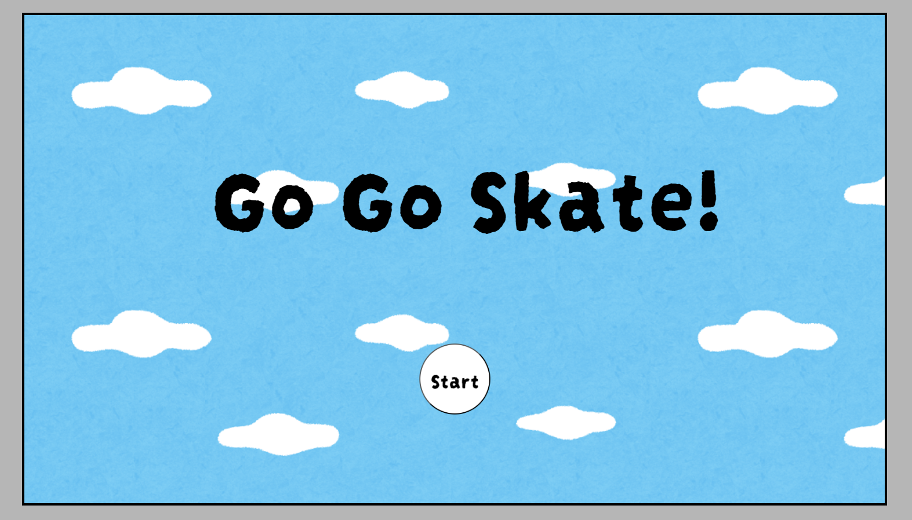
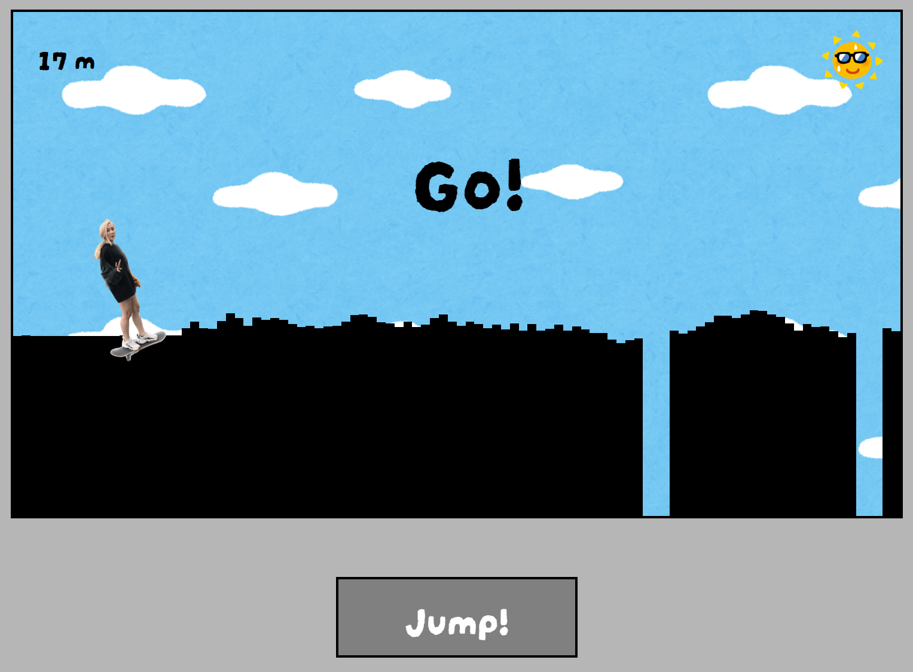
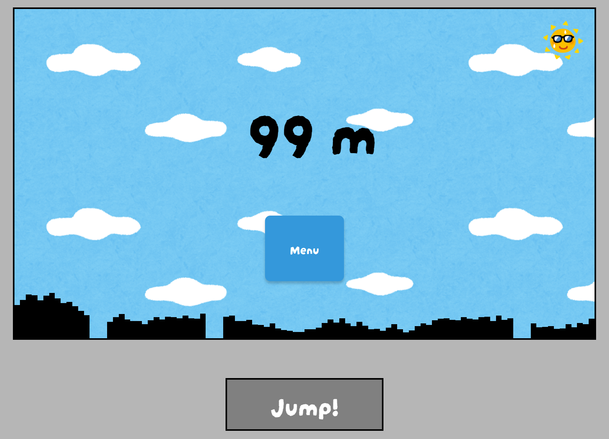

# <Game - Go Go Skate!>

## Description

#### Motivation
  Since I have studied computer science at university as well as taught myself how to develop programs, I wanted to make use of it and create a complete project from scrach by muyself
#### Why I built this project
  I built this project because I thought I would be able to understand the structure/process of a simple game development. I recently learned JavaScript and was interested in developing a web application that's dynamic and interactive. I also hoped it would entertain users like my friends and family.
#### What it does
  This is a simple game where a player character jumps over blocks moving at a constant pace. The game has a elapsed distance the player has been skating for, and the player loses the game if they fall off the blocks.
#### What I learned
  I learned how to write a simple game using HTML, CSS, and JavaScript, and the importance of trial and error when developing such a project. 

## Usage

1. Start the game by pressing the "Start" button
 
 

2. By pressing the "Jump!" button, you control the charactor to not fall off the blocks
 
 

3. Once the character falls off, you see the result distance of the character covered.  

 
